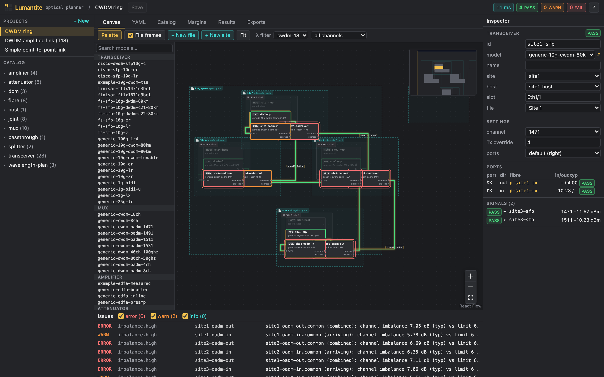
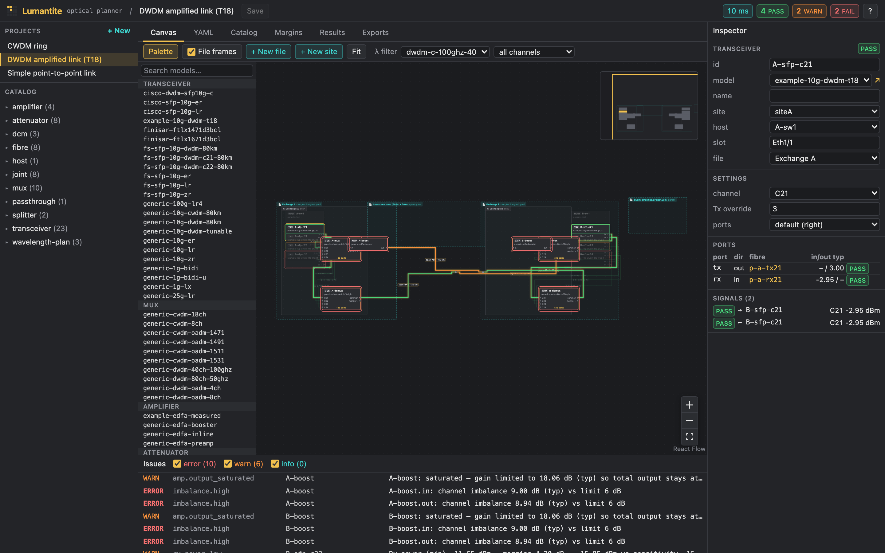
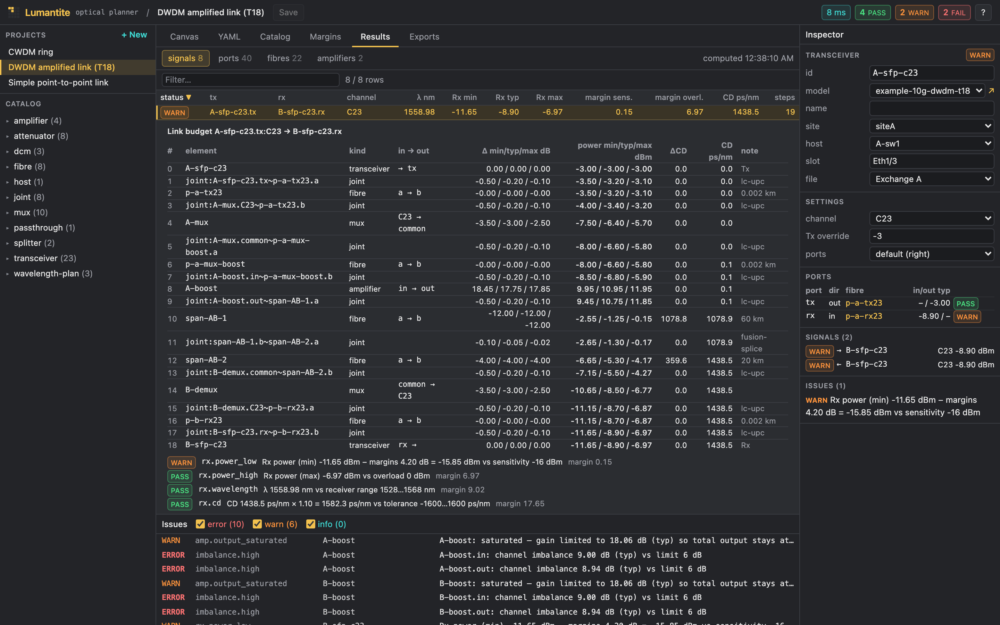
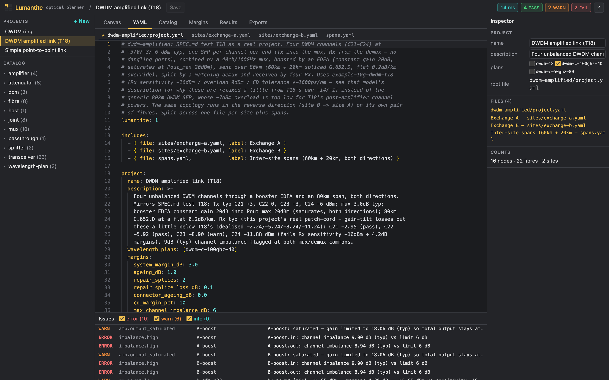
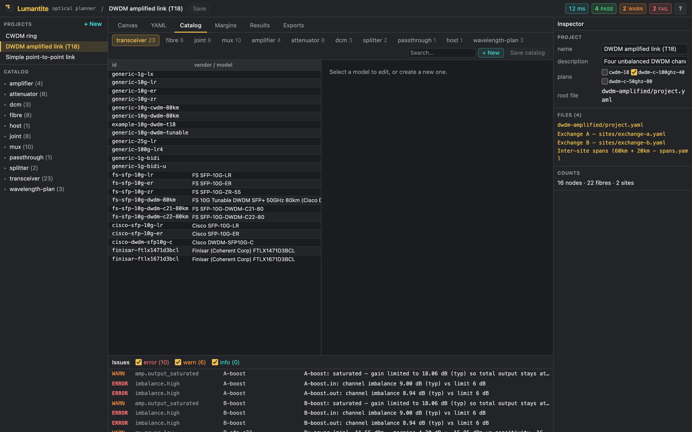
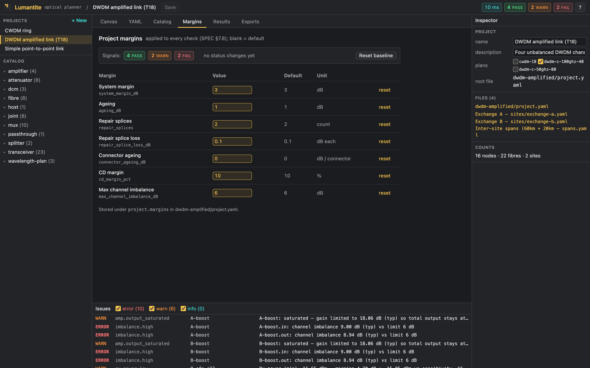

<p align="center">
  
</p>

<h1 align="center">Lumantite</h1>
<p align="center"><em>(loo-MAN-tight)</em></p>

<p align="center">
  <em>Optical network planner: power budgets, chromatic dispersion and wavelength-aware routing, edited on a canvas and stored as YAML.</em>
</p>

<p align="center">
  <a href="LICENSE"></a>
  <a href="SPEC.md"></a>
  
</p>

---

Lumantite traces every transmitter's light through patch cords, connectors, splices, mux/demux
filters, amplifiers and fibre spans to every receiver, per wavelength, and tells you whether the
link closes. It is built for DWDM and CWDM designs where the interesting questions are
"what happens to the weak channel after the booster saturates?" and "does channel 60 still
meet its dispersion tolerance at 100 km?".

## What it does

- **Per-wavelength link budgets** with worst / typical / best cases carried end to end
  (min Tx power with max losses and min gain, and vice versa). Pass/fail is always worst case.
- **Chromatic dispersion** accumulated per channel from each fibre type's dispersion model
  (ITU-T G.652 formula, linear slope, or measured table) and checked against the receiver's tolerance.
- **Wavelength-aware devices.** CWDM 18-channel, DWDM C-band 40-channel (100 GHz) and
  80-channel (50 GHz) plans. Mux/demux filters route by channel, combine channels onto the
  common port and report aggregate power and channel imbalance.
- **Amplifiers that behave like amplifiers.** Constant-gain and constant-output-power modes,
  total input power limits, output saturation, gain tilt and flatness, and an optional
  *measured* gain-spectrum model that captures channel-dependent gain from real operating-point data.
- **Joints modelled once.** Connectors and splices are catalog items; a fibre-to-fibre junction
  is one loss event, and connector families must match at ports.
- **Catalog driven.** Every transceiver, fibre type, connector, mux, amplifier, attenuator and
  DCM is a catalog model with datasheet values and a cited source. Models can `extends` a generic
  base. The catalog is YAML you can edit by hand or in the app.
- **Project margins on one page**: system margin, ageing, repair splices, connector ageing,
  dispersion margin and channel imbalance limits.
- **YAML is the source of truth.** A parent file can include fragments (one per site, one for
  spans, whatever you like), and file membership is edited visually as frames on the canvas.
  Saving rewrites only the touched values and keeps your comments and ordering intact.
- **Exports** to CSV (per port, per signal) and Markdown link-budget reports, from the UI or the CLI.

## Screenshots

**Canvas.** Sites and files are frames, devices show their ports, fibres are edges coloured by
status and drawn as right-angle routes. Selecting a transceiver highlights its signal path in both directions.



**Results.** Every signal has a classic element-by-element link budget: loss or gain per element,
cumulative power (min / typ / max) and accumulated dispersion, with each check and its margin.



**YAML editor** with schema validation and completion of model ids and endpoints, one sub-tab per file.



**Catalog** and **Margins** tabs.

<p>
  
  
</p>

## Quick start

### Docker

```bash
git clone https://github.com/ConorShore/Lumantite.git
cd Lumantite
cp config.example.yaml config.yaml
docker compose -f docker/docker-compose.yaml up --build
```

Open http://localhost:8080. On first start the container copies the starter catalog into
`./catalog` and three example projects into `./projects`. Both directories are plain YAML that you
can commit to git.

### From source

```bash
npm install
npm run build
npm run start          # http://localhost:8080, reads ./config.yaml (copy config.example.yaml)
```

For development with hot reload run the server in one terminal and `npm run dev` in another;
the Vite dev server proxies `/api` to port 8080.

### Command line

```bash
npx lumantite check projects/dwdm-amplified/project.yaml
npx lumantite export projects/dwdm-amplified/project.yaml --format all --out reports/
```

`check` prints every signal with its worst/typical/best receive power and dispersion, the
amplifier operating points and all issues, and exits non-zero on any error, which makes it
suitable for CI on a repository of designs.

### MCP server

`apps/mcp` is a [Model Context Protocol](https://modelcontextprotocol.io) server (stdio) that lets
an AI assistant such as Claude Code check projects, read link budgets, search the catalog, export
reports and edit projects. Edits are applied atomically and saved with comments and ordering kept.

| Tool | What it does |
| --- | --- |
| `check_project` | Pass/warn/fail summary, one line per signal, amplifier operating points, issues |
| `get_signal` | Element-by-element link budget and checks for one signal |
| `get_results` | Port, fibre, amplifier or issue results, optionally for one element |
| `get_project_model` | Parsed sites, nodes, fibres, margins and files |
| `search_catalog`, `get_catalog_model` | Find catalog models and wavelength plans, show a resolved definition |
| `export_project` | Markdown report or CSV (ports / signals), returned or written to a directory |
| `edit_project` | Add, update, delete, rename or move nodes, fibres and sites; set margins (supports `dry_run`) |
| `create_project`, `list_examples` | Start a new project; find the bundled examples |

After `npm run build`, the repository's `.mcp.json` registers it with Claude Code automatically.
For other clients, or from elsewhere:

```bash
claude mcp add lumantite -- node /path/to/Lumantite/apps/mcp/dist/index.js
```

Relative project paths are resolved against the server's working directory.

## How a network is described

Three tiers: a **device class** (built in: transceiver, fibre, joint, mux, amplifier, attenuator,
dcm, splitter, passthrough, host), a **catalog model** with a real make and model's numbers, and an
**instance** in your project with per-instance settings.

```yaml
# project.yaml
lumantite: 1
includes:
  - { file: sites/exchange-a.yaml, label: Exchange A }
  - { file: spans.yaml,            label: Inter-site spans }
project:
  name: Metro ring east
  wavelength_plans: [dwdm-c-100ghz-40]
  margins: { system_margin_dB: 3.0, ageing_dB: 1.0, repair_splices: 2 }

# sites/exchange-a.yaml
nodes:
  - { id: A-sfp-21, model: fs-sfp-10g-dwdm-c21-80km, site: siteA, host: A-sw1, slot: Eth1/1 }
  - { id: A-mux,    model: generic-dwdm-40ch-100ghz, site: siteA }
  - { id: A-boost,  model: generic-edfa-booster,     site: siteA,
      settings: { mode: constant_gain, gain_dB: 20 } }
fibres:
  - { id: p1, type: lc-patch, a: { to: A-sfp-21.tx },  b: { to: A-mux.C21 } }
  - { id: p2, type: lc-patch, a: { to: A-mux.common }, b: { to: A-boost.in } }

# spans.yaml
fibres:
  - id: span-AB-1
    type: g652d
    length_km: 60
    a: { joint: lc-upc,        to: A-boost.out }
    b: { joint: fusion-splice, to: span-AB-2.a }   # one splice, counted once
```

A fibre is a single core with two ends. Each end names its joint (a connector or a splice) and
what it connects to: a device port such as `A-mux.C21`, or the end of another fibre. A duplex link
is two fibres. Amplifiers are the only directional devices; everything passive works both ways.

Catalog entries look like this:

```yaml
- kind: amplifier
  id: generic-edfa-booster
  band_nm: [1528, 1566]
  modes: [constant_gain, constant_output_power]
  gain_dB: { min: 10, max: 23 }
  input_power_total_dBm: { min: -30, max: 5 }
  output_power_total_dBm: { max: 20 }
  gain_flatness_dB: 1.0
  gain_tilt: [ { nm: 1528, dB: 0.5 }, { nm: 1566, dB: -0.5 } ]
  noise_figure_dB: 5.5
```

The full data model, physics and check rules are in [SPEC.md](SPEC.md); the package APIs are in
[docs/CONTRACT.md](docs/CONTRACT.md); every starter catalog model and its source is listed in
[packages/catalog/README.md](packages/catalog/README.md).

## Physics in one paragraph

Powers are summed in milliwatts and reported in dBm. Fibre attenuation is interpolated at the
signal's exact wavelength from the fibre type's table; dispersion uses D(λ) = S₀/4 · (λ − λ₀⁴/λ³)
for G.652 fibre. An EDFA's gain is set by its total input power: in constant-gain mode the gain is
reduced when the output would exceed the maximum, in constant-output-power mode it is clamped to
the gain range, and each channel then gets the gain shaped by the tilt table (or by a measured
spectrum interpolated at the actual operating point). Receivers are checked for minimum power
after margins, overload, wavelength range and dispersion tolerance. Out of scope for now: OSNR
and ASE noise, PMD, nonlinear effects, reflections and ROADM switching. The schema keeps an `x:`
map on every object so such data can be recorded before the engine uses it.

## Repository layout

```
packages/schema    zod schemas and shared types
packages/engine    physics, propagation, checks, exports (pure, runs in a web worker and in Node)
packages/project   comment-preserving YAML sessions for projects and the catalog
packages/catalog   starter catalog (67 models, 3 wavelength plans) and example projects
apps/server        Fastify file API with etag conflict detection + static hosting
apps/cli           lumantite check | export
apps/mcp           MCP server exposing checks, results, catalog, exports and edits as tools
apps/web           React 19 + React Flow + Monaco, dark theme
docker/            Dockerfile and docker-compose.yaml
scripts/           screenshots.mjs (Playwright)
```

## Testing

```bash
npm test
```

The engine is tested against hand-derived physics cases (spec section 12): single spans, spliced
sections, CWDM interpolation, mux combining with unequal channels, saturated and clamped
amplifiers, tilt, measured gain spectra, cascaded amplifiers, amplified loops, BiDi optics and a
500-node / 5 000-fibre performance case. Every assertion shows its arithmetic in a comment. The
project package tests byte-for-byte round-tripping of commented, multi-file YAML.

## License and disclaimer

Lumantite is released under the [Apache License 2.0](LICENSE). It is a planning aid only: its
calculations and exports may be wrong and are provided without warranty. The author accepts no
liability for decisions made on the basis of its output. Read [DISCLAIMER.md](DISCLAIMER.md)
before relying on any result, and verify every design against manufacturer datasheets and field
measurements.
